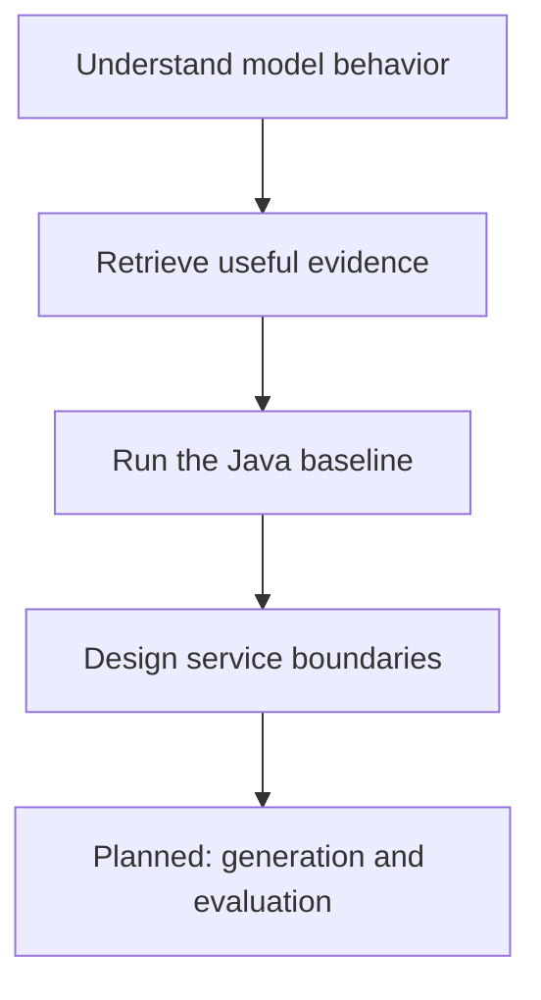

# My AI Journey

AI engineering explained for software developers and architects, with small
working examples and production trade-offs. I am an experienced software
architect learning AI through explanations, experiments, and practical projects.

Start with [LLMs as software components](learning/llm-components.md), then
[retrieval and evidence](learning/retrieval.md), and run the
[Java runbook assistant](projects/runbook-assistant/README.md).

## Who this is for

Java and backend developers entering AI, architects designing LLM applications,
and beginners who want intuition before mathematics. Examples connect familiar
ideas—API contracts, queues, deadlines, and tests—to model-based systems.
You do not need a GPU or a paid account for the first project.

## Learning path and progress



| Material                                                       | Status    | What is available                                |
| -------------------------------------------------------------- | --------- | ------------------------------------------------ |
| [LLM foundations](learning/llm-components.md)                  | Available | Conceptual explanation and prompt exercise       |
| [Retrieval and embeddings](learning/retrieval.md)              | Available | Conceptual explanation and vector calculation    |
| [Runbook assistant](projects/runbook-assistant/README.md)      | Available | Working Java retrieval and excerpt example       |
| [Backend architecture](architecture/document-assistant.md)     | Available | Design walkthrough; service is not implemented   |
| [Glossary](learning/glossary.md) and [resources](RESOURCES.md) | Available | Definitions and external learning resources      |
| Spring AI generation, Python comparison, evaluation lab        | Planned   | Acceptance criteria in the [roadmap](ROADMAP.md) |

Available means the linked artifact exists; it does not imply a production system.
In progress is reserved for work present on a branch. No module currently has that status.

## Practical project

The **runbook assistant** finds passages in fictional operational documentation.
It uses word-count vectors and cosine similarity, then returns a verbatim excerpt
with a source ID. It has tests and a small retrieval evaluation set.
It does **not** use learned embeddings or generate answers with an LLM.
This baseline makes retrieval failures visible before adding model variability.

The [architecture walkthrough](architecture/document-assistant.md) develops this
into a proposed Spring AI service with authorization, bounded concurrency,
deadlines, evaluation, and a read-only boundary. Production controls are design
recommendations, not claims about the CLI.

## How to use this repository

1. Read the two learning modules in order. Use the glossary when a term is new.
2. Run the project and change one query or document. Inspect the retrieved source.
3. Try the failure exercises, then review the architecture trade-offs.
4. Use external resources for depth; the roadmap identifies content still to come.

## Prerequisites and local setup

Basic programming, a terminal, Git, and JDK 21 or newer are enough for the project.
No Python, Docker, model download, or API key is needed. Node.js 22+ and npm
are needed only for repository maintenance.

```sh
git clone https://github.com/manikandan-ganesan-hub/my-ai-journey.git
cd my-ai-journey/projects/runbook-assistant
javac --release 21 -d build src/RunbookAssistant.java src/RunbookAssistantTest.java
java -cp build RunbookAssistantTest
java -cp build RunbookAssistant data/runbooks.tsv "How do I handle duplicate events?"
```

See the [project README](projects/runbook-assistant/README.md) for expected output,
evaluation, configuration, and limitations. From the repository root, maintainers
can run `npm ci` and `npm test`; see [CONTRIBUTING](CONTRIBUTING.md) for all checks.

## Repository structure

```text
learning/                   Two modules and a glossary
projects/runbook-assistant/  Java source, tests, and synthetic fixtures
architecture/               Backend design walkthrough
scripts/                    Link checking and Java verification
.github/                    CI, Dependabot, and contribution templates
ROADMAP.md                  Planned work with completion criteria
RESOURCES.md                Checked sources and reading suggestions
docs/                       Initial audit and release verification
```

## Contributing and attribution

Corrections, reproducible failures, and small experiments are welcome. Read
[CONTRIBUTING.md](CONTRIBUTING.md) before changing code or adding a topic.
Use original explanations and diagrams. Cite official documentation or original
papers beside technical claims; record an access date for changing documentation.
External resources remain the work of their authors and are not bundled here.

## Next steps

Add a tested Spring AI generation adapter, compare retrieval methods on a larger
dataset, then add a Python comparison. Mathematics, ML workflow, deployment,
and agent topics remain in the [roadmap](ROADMAP.md); no empty topic folders are
created to imply coverage.

## Author and license

Manikandan Ganesan is a technology architect with 18+ years in enterprise and
low-latency systems, including Java, Spring Boot, Kafka, Flink, Redis, RocksDB,
and financial platforms. This repository documents learning in AI engineering;
it does not claim AI research expertise or production AI deployments.

Original code and documentation are available under the [MIT license](LICENSE).
