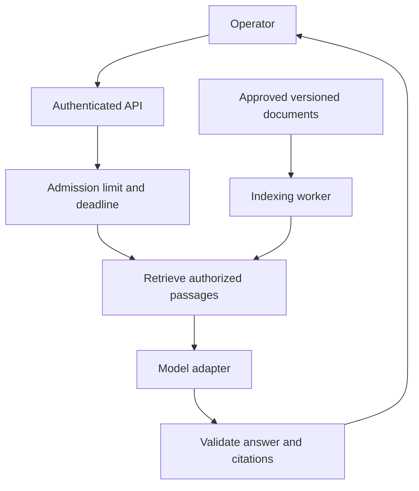

# A document assistant beside a backend platform

Status: Available · Architecture example · Proposed service, not deployed code

[Previous: Java project](../projects/runbook-assistant/README.md) ·
[Home](../README.md) · [Next: Roadmap](../ROADMAP.md)

## Scenario and boundary

An operator asks questions about synthetic event-processing runbooks. The assistant
finds documentation and explains it. It does not participate in order acceptance,
risk calculation, or market-data processing. Those paths retain deterministic
rules and their own latency budgets.

The [working CLI](../projects/runbook-assistant/README.md) demonstrates retrieval
and citations. The service below is a design exercise: authentication, HTTP,
Spring AI, generation, concurrency controls, and telemetry are not implemented.



Keep indexing outside the request path. A Kafka event can announce a changed
document, but consumers must handle duplicates, deletions, version ordering, and
reindexing failures. Kafka does not make an embedding index automatically current.

## Proposed API contract

`POST /v1/document-answers` accepts a question and a collection ID. Derive the
caller and tenant from authenticated server context, not from model text or an
untrusted request field. Resolve the requested collection against caller access.

Illustrative response, not output from a running server:

```json
{
  "status": "ANSWERED",
  "answer": "Compare the event ID with the processed ID store.",
  "sources": [{ "id": "duplicate-events", "revision": "demo-v1" }],
  "requestId": "demo-request-17"
}
```

Allow `INSUFFICIENT_EVIDENCE` with no answer as a successful domain result.
Reject malformed requests with 400, unauthorized access with 403, admission
overload with 429, and exhausted upstream deadlines with 504. Define these statuses
in application code. The model cannot authorize access or choose the HTTP result.
Avoid revealing whether an inaccessible document exists through error detail.

## Java and Spring AI integration

Use application-owned interfaces such as `Retriever` and `AnswerGenerator`.
Keep HTTP types and provider SDK objects at adapters. Records can hold a question,
authorized passages, answer status, and source references. Fake adapters make
timeout and invalid-output paths testable without API charges.

[Spring AI](https://docs.spring.io/spring-ai/reference/) provides Java abstractions
for chat models, embeddings, vector stores, structured output, and observability.
Its [RAG integration](https://docs.spring.io/spring-ai/reference/api/retrieval-augmented-generation.html)
is a credible next step once this repository has a tested model adapter.
Choose compatible Spring Boot/Spring AI releases and pin them in that future
project. The current example has no Spring dependency or claimed integration.
References accessed 2026-09-21.

Do not assume provider interchangeability. Validate context limits, error mapping,
usage metadata, and structured-output behavior for every adapter. Switching the
Java interface implementation still requires rerunning the evaluation set.

## Controls and trade-offs

| Concern         | Proposed control                                                                                      | Cost or limitation                                                                      |
| --------------- | ----------------------------------------------------------------------------------------------------- | --------------------------------------------------------------------------------------- |
| Deadlines       | Carry one end-to-end budget through retrieval and generation; cancel downstream work                  | Cancellation may not stop provider billing                                              |
| Retries         | Retry selected transient failures with jitter and a small attempt limit inside the remaining deadline | Retries consume capacity and may incur another charge; do not retry validation failures |
| Rate limits     | Apply per-tenant request/token budgets before calling a provider                                      | A request limit alone misses differences in token size                                  |
| Backpressure    | Bound in-flight calls and queue length; reject when full                                              | Some requests fail fast during bursts                                                   |
| Caching         | Include tenant, authorization scope/version, document revisions, model, and prompt in cache identity  | Permission changes need invalidation; hit rate may be low                               |
| Prompt versions | Store instructions with code and include their version in traces/evals                                | A tiny wording change can require regression review                                     |
| Usage           | Record input/output token usage and price-table version when estimating cost                          | Estimates differ from final invoices; do not hard-code prices in lessons                |
| Observability   | Measure queue, retrieval, and generation latency separately; count errors and abstentions             | Raw prompts can contain private data, so avoid default content logging                  |
| Output          | Validate schema, source allowlist, revision, and factual support                                      | Existing citation IDs alone do not prove grounding                                      |

For example, suppose load testing supports a proposed limit of 16 model calls in
flight per instance. A Java `Semaphore` can reject a seventeenth call rather than
building an unbounded queue. Release the permit on success, failure, and cancellation.
This number is illustrative, not measured capacity. Virtual threads reduce some
thread-management costs; they do not remove provider quotas or memory limits.
See the [Java 21 Semaphore API](https://docs.oracle.com/en/java/javase/21/docs/api/java.base/java/util/concurrent/Semaphore.html)
(accessed 2026-09-21). A multi-instance service also needs coordinated tenant limits.

## Privacy, injection, and actions

Filter documents by authorization before model submission. Minimize data sent to
the provider and decide retention and regional requirements before choosing one.
This repository uses invented text only; never substitute employer runbooks or
customer/trading data into a public example.

A retrieved passage may contain an instruction to reveal secrets. Treat it as
data and test that attack explicitly. A prompt saying "ignore malicious text"
is insufficient. Limit accessible tools and data in application code, validate
every tool argument, and keep credentials outside model-visible context.

This scenario is read-only. A later workflow that changes configuration must
require an explicit human approval tied to the exact action and arguments, plus
server-side authorization and an audit trail. A model-generated "approved" field
must never satisfy that gate. See Anthropic's
[workflow and agent discussion](https://www.anthropic.com/engineering/building-effective-agents)
for choosing the smallest orchestration that serves a task (accessed 2026-09-21).

## Review the design with failures

| Test case                                           | Expected behavior                                   |
| --------------------------------------------------- | --------------------------------------------------- |
| Relevant document belongs to another tenant         | No passage, citation, or prompt content leaks       |
| Index still contains a deleted revision             | Version/access validation excludes it               |
| Provider times out after the client disconnects     | Work is cancelled, permit released, timeout counted |
| Provider returns valid JSON with an invented source | Application rejects the answer                      |
| Retrieved text requests an administrative action    | No action is available to the read-only assistant   |
| Request burst exceeds configured capacity           | Bounded memory and explicit overload responses      |

Before claiming production readiness, implement and run these tests, measure
latency percentiles and saturation under a stated workload, and evaluate grounding
on held-out questions. The next delivery criteria are in the [roadmap](../ROADMAP.md).
