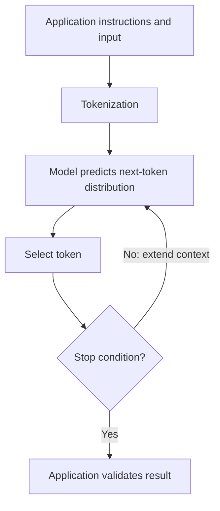

# LLMs as software components

Status: Available · Conceptual explanation · No model execution in this module

[Previous: Start](../README.md) · [Home](../README.md) · [Next: Retrieval](retrieval.md)

## Start with a familiar problem

A backend service receives a failed synthetic trade event and a diagnostic
message. You want a readable explanation for an operator. Ordinary code should
still validate the event, identify its status, and enforce access rules. A language
model can help express the explanation. It should not decide whether a trade
is valid or whether a risk limit may be bypassed.

An **AI system** performs tasks associated with intelligence, such as recognizing
patterns or producing language. **Machine learning** learns patterns from data
instead of requiring a rule for every case. **Deep learning** uses neural networks
with multiple layers. A **large language model (LLM)** is a language model trained
at scale; many current text generators use transformer neural networks.

These terms describe overlapping scopes, not a required technology stack.
A deterministic rule can be the right solution even when an LLM is available.

## Mental model: a conditional text generator

Think of a generative LLM as a component that proposes a continuation given some
context. Text is split into **tokens**: model-specific pieces that may be words,
parts of words, punctuation, or other symbols. A tokenizer maps those pieces to IDs.
Do not estimate hard input limits from character counts alone.

During training, model parameters—learned numerical values—change to reduce a
training objective. In next-token pretraining, the model learns to predict the
next token from preceding tokens. Later training can change how it follows
instructions. At inference time, the application supplies input and uses the
trained parameters to produce output; an ordinary prompt does not retrain them.

A transformer uses **attention** to combine information from token positions.
For example, interpreting "it" may depend on a noun earlier in the sentence.
Attention helps represent such relationships. It does not make the model a
database or guarantee that an explanation matches a source.



This is a simplified text-generation loop. It omits batching, caches, and
model-specific inference details. See the original
[transformer paper](https://arxiv.org/abs/1706.03762) and
[Hugging Face explanation](https://huggingface.co/learn/llm-course/chapter1/4)
for the underlying mechanism (accessed 2026-09-21).

## A small prompt exercise

The following is a proposed input, not an observed model response:

```text
Task: Explain the supplied event in one sentence for an operator.
Use only the supplied facts. If the reason is missing, say it is unknown.
Do not recommend changing limits or submitting another order.

Synthetic event:
eventId: demo-17
status: REJECTED
reasonCode: LIMIT_EXCEEDED
definition: The configured quantity limit was exceeded.
```

A reasonable target answer is: "Event demo-17 was rejected because its quantity
exceeded the configured limit." That is an expected answer for an evaluation,
not evidence that a model consistently produces it.

Remove `reasonCode` and `definition`. Now the target should say the reason is
unknown. If a model invents a reason, that is a failure even if the sentence
sounds plausible. For this tiny task, a template can produce both answers more
reliably and cheaply; language variation alone may not justify a model call.

## From prompt to contract

A prompt describes desired behavior. A service contract describes accepted input,
output, and failure. Keep them separate:

| Boundary      | Application responsibility                                               |
| ------------- | ------------------------------------------------------------------------ |
| Input         | Validate fields, size, caller identity, and authorized evidence          |
| Model request | Choose versioned instructions, model, deadline, and output budget        |
| Output        | Parse and validate structure; check cited sources and domain constraints |
| Failure       | Return an explicit timeout, unavailable, or insufficient-evidence result |

**Structured output** constrains the shape of a response, such as JSON fields.
Schema-valid JSON can still contain false facts or unauthorized IDs. Validate
meaning as well as syntax. Never convert free-form model text directly into a
database command or a trading operation.

## Trade-offs that change system design

- A larger context window can fit more evidence, but irrelevant text can distract
  the model and increase processing cost. Context length is capacity, not quality.
- **Temperature** influences token sampling in models that support it. Lower
  variability does not establish truth or guarantee identical responses.
- Retrieval supplies selected evidence at request time. Fine-tuning changes model
  weights. Neither automatically gives the model current, authorized facts.
- Hosted models reduce infrastructure work but introduce network, retention,
  pricing, and availability dependencies. Local inference needs hardware sizing,
  model licensing review, upgrades, and operational support.

## Production questions before adding a model

Define a useful outcome before choosing a provider: can an operator locate the
right runbook faster, and can unsupported questions remain unanswered? Assemble
representative examples, including failures. Compare with a rules-based baseline.
Track correctness separately from latency and expense; a fast invented answer
is not a successful request.

Record model, prompt, corpus, and evaluation versions. Limit requests and tokens.
Measure retrieval and generation time separately. Do not log confidential prompt
contents by default. A model-provider interface helps testing, but providers still
differ in tokenizers, capabilities, error behavior, and usage reporting.

Common mistakes include treating fluent output as evidence, using a prompt as
authorization, testing only happy paths, and reporting a few examples as an
accuracy benchmark. Evaluation guidance from
[OpenAI](https://developers.openai.com/api/docs/guides/evaluation-best-practices)
is useful for building task-specific regression sets (accessed 2026-09-21).

## Try it yourself

1. Write expected answers for the event above, a missing reason, and an unknown code.
2. Implement the explanation with a lookup table on paper. Identify what an LLM
   would add that the table cannot do.
3. Propose one forbidden action and show which application boundary rejects it.

You should be able to explain why generation is useful, why it can be wrong,
and why ordinary software controls still own the final decision.

Further study: the [Hugging Face LLM course](https://huggingface.co/learn/llm-course/chapter1/1)
and the [resource list](../RESOURCES.md). Accessed 2026-09-21.
