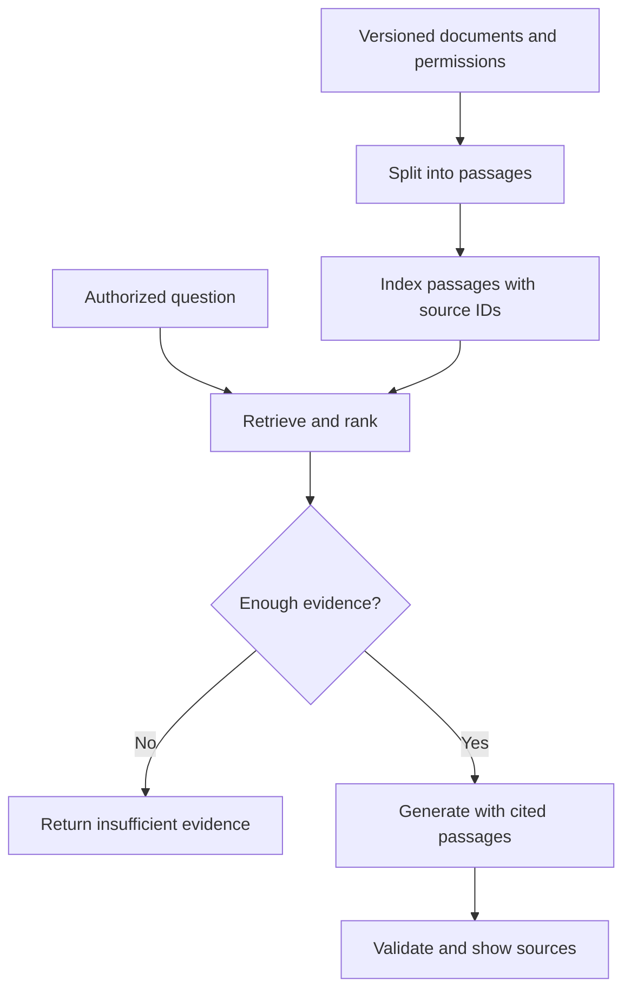

# Retrieve evidence before writing an answer

Status: Available · Conceptual explanation with a linked working baseline

[Previous: LLM components](llm-components.md) · [Home](../README.md) ·
[Next: Java project](../projects/runbook-assistant/README.md)

## The problem

An operator asks, "How do I handle duplicate events?" A model's training data
cannot be assumed to contain your current runbook. Retrieval finds relevant
passages in a controlled collection. **Retrieval-augmented generation (RAG)**
then gives those passages to a generator as evidence for its answer.

The analogy is an open-book question: finding the right page and interpreting it
are different tasks. An incorrect page can produce an incorrect answer even when
the generator follows instructions. Correct evidence can also be misrepresented.

Our [Java project](../projects/runbook-assistant/README.md) implements retrieval
and returns an excerpt. It stops before generation. It is a baseline for a future
RAG system, not a full RAG implementation.

## Vectors without heavy mathematics

A **vector** is an ordered list of numbers. With vocabulary `[duplicate, event,
latency]`, the text "duplicate event" becomes the count vector `[1, 1, 0]`.
"event latency" becomes `[0, 1, 1]`. Multiplying corresponding entries and adding
gives a **dot product** of 1. Both vector lengths are the square root of 2, so
their **cosine similarity** is `1 / (sqrt(2) * sqrt(2)) = 0.5`.

Cosine compares direction rather than raw length. In this non-negative word-count
example, 1 means identical direction and 0 means no shared words. It is not a
probability that a passage answers the question. Zero-length vectors need special
handling; the project returns similarity 0 rather than dividing by zero.

A **learned embedding** also represents text numerically, but a trained model
produces its values. Nearby vectors can capture related meanings even when words
differ. Quality depends on the model, language, domain, and task. Learned
embeddings may also use negative components, so cosine need not be non-negative.

The project uses sparse word counts, not learned embeddings. "Duplicate events"
and "replayed messages" need not match at all. That visible limitation is useful:
semantic retrieval should earn its additional dependencies through evaluation.

## How a document system fits together

This is a proposed RAG flow. The CLI substitutes a verbatim excerpt for the
generation step and does not implement access control or a sufficiency classifier.
Its threshold only filters weak lexical overlap.

## Decisions hidden behind the diagram

**Passages.** Split documents where an idea ends, keeping headings and exceptions
together. Smaller chunks can improve focus but lose context. Larger chunks consume
more context and may mix unrelated guidance. Preserve document ID, revision,
section, and permissions alongside the text. The project uses one short runbook
per TSV row so the chunk boundary is visible and manually controlled.

**Index.** An index is a searchable representation, not the authoritative document
store. Rebuild or update it when source text, deletion state, or permissions change.
If you change an embedding model, re-embed the corpus and query consistently;
matching dimensions alone does not make embedding spaces compatible.

**Ranking.** Lexical search is strong for exact IDs and jargon. Learned embeddings
can help paraphrases. Hybrid search combines signals; a reranker can reorder
candidates at added latency and cost. A vector database is one implementation
choice, not a requirement for RAG. For three documents, an in-memory scan is enough.

**Abstention.** A similarity threshold is a retrieval heuristic. A passage sharing
"events" may still be unrelated to the user's intent. A system needs evaluated
rules for missing evidence, conflicting versions, and unsupported subquestions.
Do not label a similarity score as answer confidence.

## Evaluate retrieval separately

Create question-to-relevant-source labels before tuning. If each query has one
relevant source, **hit@k** is the fraction with that source in the first `k` results.
**Recall@k** handles multiple relevant sources by measuring how many were found.
Evaluate unanswerable queries separately: returning something for every question
can make a demonstration look successful while concealing unsupported answers.

The project includes a tiny fixture with direct matches, a known paraphrase miss,
and an out-of-domain question. It reports hits and abstentions, not a production
accuracy figure. A larger experiment should keep tuning examples separate from
held-out evaluation and include permission, stale-data, and adversarial cases.

For generation, also check whether each factual claim is supported by the cited
passage. A citation can exist without supporting the claim. A model-based grader
can help triage, but compare it with human judgments before trusting its scores.

## Security and operational trade-offs

Apply document permissions before returning candidates or sending them to a model.
Filtering only the final answer can already have leaked text to the provider.
Treat retrieved documents as untrusted data: text that says "ignore previous
instructions" is not a new system instruction. Delimiters and prompts help
organization but do not prove resistance to injection.

In a deployed service, bound query size, retrieved passage count, and total prompt
tokens. Cache keys must account for tenant, authorization, source revision,
model, and prompt version. Observe empty retrievals, source freshness, latency,
and answer-quality regressions. The [architecture example](../architecture/document-assistant.md)
explains the service boundary; these controls are not implemented by the CLI.

## Try it yourself

1. Run the duplicate-events query in the project. Read the source, not just its score.
2. Replace it with "replayed messages". Explain why lexical retrieval fails.
3. Ask "How do I delete events?" and inspect any retrieved passage. Word overlap
   can return evidence that does not answer the question.
4. Add a short synthetic passage and a labeled query. Run the evaluation again.

Retrieval chooses evidence; generation composes language. Test those stages
separately, and make insufficient evidence an ordinary result.

## Further reading

- [Original RAG paper](https://arxiv.org/abs/2005.11401): learned retrieval combined
  with generation; this project's lexical baseline does not reproduce the paper.
- [Spring AI RAG reference](https://docs.spring.io/spring-ai/reference/api/retrieval-augmented-generation.html):
  Java application integration.
- [LangChain retrieval documentation](https://docs.langchain.com/oss/python/deepagents/retrieval):
  another framework's treatment of retrieval.

Sources accessed 2026-09-21. Diagrams and numerical examples are original.
